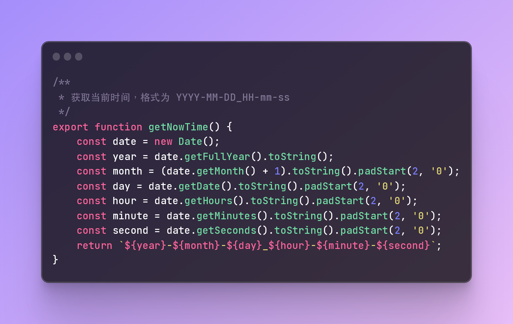

# CODE IMAGE

Create Code Image By RaySO

## How to use

copy the code you want to convert to image to the clipboard, then run the script, the image will be saved to the clipboard.

## Example

```javascript
/**
 * 获取当前时间，格式为 YYYY-MM-DD_HH-mm-ss
 */
export function getNowTime() {
    const date = new Date();
    const year = date.getFullYear().toString();
    const month = (date.getMonth() + 1).toString().padStart(2, '0');
    const day = date.getDate().toString().padStart(2, '0');
    const hour = date.getHours().toString().padStart(2, '0');
    const minute = date.getMinutes().toString().padStart(2, '0');
    const second = date.getSeconds().toString().padStart(2, '0');
    return `${year}-${month}-${day}_${hour}-${minute}-${second}`;
}
```


